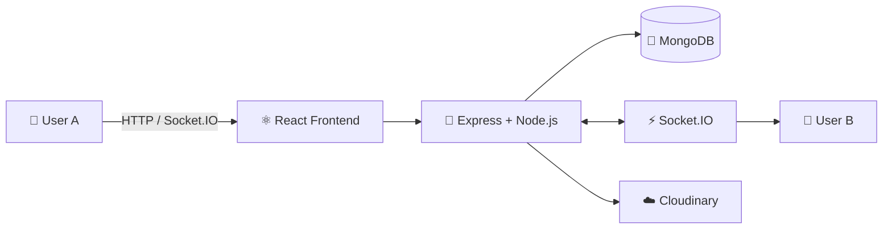
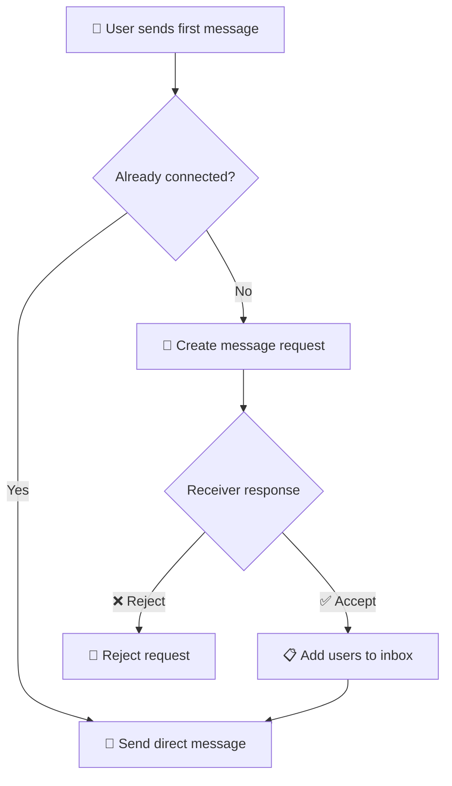

<div align="center">

# 💬 Chat App

### ✨ A modern real-time messaging application built for seamless communication ✨


<br/>

<a href="https://chat-app-cezq.onrender.com/" target="_blank" rel="noopener noreferrer">
  
</a>
<a href="https://github.com/AlokSharma13/Chat_app" target="_blank" rel="noopener noreferrer">
  
</a>

<br/><br/>


</div>

---

## 🌐 Live Application

<div align="center">

### 👇 Try the application

**[🚀 Open Chat App](https://chat-app-cezq.onrender.com/)**

</div>

---

## ✨ Features

<table>
<tr>
<td width="50%">

### 🔐 Authentication
- User registration & login
- JWT-based authentication
- Protected routes
- bcrypt password hashing
- Secure logout
- Account deletion

</td>
<td width="50%">

### 💬 Messaging
- One-to-one messaging
- Real-time communication
- Message history
- Message deletion
- Inbox/chat list
- Last-message ordering

</td>
</tr>
<tr>
<td width="50%">

### 📩 Message Requests
- Send requests to new users
- Accept requests
- Reject requests
- Delete requests
- Real-time request notifications

</td>
<td width="50%">

### 🖼️ Media & Profile
- Image sharing
- Cloudinary integration
- Upload progress events
- Upload error handling
- Profile picture updates
- Responsive UI

</td>
</tr>
</table>

---

## 🛠️ Tech Stack

<div align="center">

| Layer | Technologies |
|:---:|:---|
| 🎨 **Frontend** | React 19 · Vite · React Router · Zustand · Axios · Tailwind CSS · DaisyUI · Framer Motion · Lucide React |
| ⚙️ **Backend** | Node.js · Express.js · Socket.IO |
| 🗄️ **Database** | MongoDB · Mongoose |
| 🔐 **Authentication** | JWT · bcryptjs · Cookie Parser |
| ☁️ **Media** | Cloudinary |
| 🚀 **Deployment** | Render |

</div>

---

## ⚡ Real-Time Architecture



### 🔄 Message Flow

```text
┌─────────────┐       HTTP / Socket.IO       ┌──────────────────┐
│   👤 User   │ ──────────────────────────▶ │ ⚛️ React Client  │
└─────────────┘                              └────────┬─────────┘
                                                     │
                                                     ▼
                                            ┌──────────────────┐
                                            │ 🚀 Express API   │
                                            └────────┬─────────┘
                                                     │
                              ┌──────────────────────┼──────────────────────┐
                              ▼                      ▼                      ▼
                        ┌──────────┐          ┌──────────┐          ┌────────────┐
                        │ 🔐 JWT   │          │ 🍃 Mongo │          │ ☁️ Cloudinary│
                        │   Auth   │          │    DB    │          │   Images   │
                        └──────────┘          └──────────┘          └────────────┘
                                                     │
                                                     ▼
                                            ┌──────────────────┐
                                            │ ⚡ Socket.IO     │
                                            │ Real-time Events │
                                            └────────┬─────────┘
                                                     │
                                                     ▼
                                            ┌──────────────────┐
                                            │ 👤 Receiver      │
                                            └──────────────────┘
```

---

## 📩 Message Request Workflow

The application separates **new-user conversations** from established contacts.



This workflow is backed by the `MessageRequest` and `UserInbox` models.

---

## 🔐 Authentication Flow

```text
📝 Sign Up
    ↓
🔒 Password → bcrypt hash
    ↓
🎟️ JWT generated
    ↓
🍪 JWT stored in HTTP cookie
    ↓
🛡️ Protected API requests
    ↓
✅ Authentication middleware
    ↓
👤 Authorized user
```

---

## 🖼️ Image Upload Flow

Images are uploaded to **Cloudinary**, while the resulting secure URL is stored with the message.

```text
🖼️ Select Image
      ↓
⚛️ React Client
      ↓
🚀 Backend API
      ↓
☁️ Cloudinary Upload
      ↓
🔗 Secure Image URL
      ↓
🍃 MongoDB Message
      ↓
⚡ Socket.IO Update
      ↓
👤 Receiver
```

---

## 📁 Project Structure

```text
Chat_app/
│
├── 📂 backend/
│   ├── 📂 src/
│   │   ├── 📂 controllers/
│   │   │   ├── auth.controller.js
│   │   │   ├── message.controller.js
│   │   │   └── messageRequest.controller.js
│   │   ├── 📂 lib/
│   │   │   ├── cloudinary.js
│   │   │   ├── db.js
│   │   │   ├── socket.js
│   │   │   └── utils.js
│   │   ├── 📂 middleware/
│   │   │   └── auth.middleware.js
│   │   ├── 📂 models/
│   │   │   ├── message.model.js
│   │   │   ├── messageRequest.model.js
│   │   │   ├── user.model.js
│   │   │   └── userInbox.model.js
│   │   ├── 📂 routes/
│   │   ├── 📂 seeds/
│   │   └── index.js
│   ├── .env.example
│   └── package.json
│
├── 📂 frontend/
│   ├── 📂 src/
│   │   ├── 📂 components/
│   │   ├── 📂 Pages/
│   │   ├── 📂 store/
│   │   ├── App.jsx
│   │   └── ...
│   ├── 📂 public/
│   └── package.json
│
└── 📄 README.md
```

---

## ⚙️ Run Locally

### 1️⃣ Clone the repository

```bash
git clone https://github.com/AlokSharma13/Chat_app.git
cd Chat_app
```

### 2️⃣ Install backend dependencies

```bash
cd backend
npm install
```

### 3️⃣ Install frontend dependencies

```bash
cd ../frontend
npm install
```

### 4️⃣ Configure environment variables

Create `.env` inside `backend/`:

```env
MONGODB_URI=your_mongodb_connection_string
PORT=5000
NODE_ENV=development
JWT_SECRET=your_jwt_secret
CLIENT_URL=http://localhost:5173
CLOUDINARY_CLOUD_NAME=your_cloudinary_cloud_name
CLOUDINARY_API_KEY=your_cloudinary_api_key
CLOUDINARY_API_SECRET=your_cloudinary_api_secret
```

> ⚠️ Never commit your real `.env` file or production secrets.

### 5️⃣ Start the backend

```bash
cd backend
npm run dev
```

### 6️⃣ Start the frontend

Open another terminal:

```bash
cd frontend
npm run dev
```

---

## 📜 Available Scripts

### Backend

```bash
npm run dev    # 🔥 Development server with Nodemon
npm start      # 🚀 Production server
```

### Frontend

```bash
npm run dev      # ⚡ Start Vite
npm run build    # 📦 Production build
npm run preview  # 👀 Preview production build
npm run lint     # 🔍 Run ESLint
```

---

## 🔒 Environment Variables

The repository includes `backend/.env.example` containing configuration placeholders for:

- 🍃 MongoDB
- 🎟️ JWT
- 🌐 Client URL / Render
- ☁️ Cloudinary

Never expose real API keys, database credentials, or JWT secrets in the repository.

---

## 🚧 Future Improvements

- ⌨️ Typing indicators
- ✔️ Read receipts
- 👥 Group conversations
- 🔔 Push notifications
- ❤️ Message reactions
- 🔒 More granular message privacy controls

---

## 👨‍💻 Author

<div align="center">

### **Alok Sharma**

<a href="https://github.com/AlokSharma13">
  
</a>

<br/><br/>

⭐ **If you like this project, consider giving the repository a star!** ⭐

</div>

---

<div align="center">

### 💙 Thanks for visiting!


</div>
